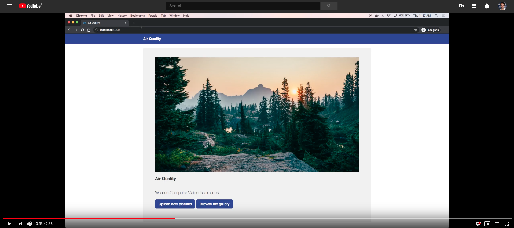

# Air Quality

This project uses Computer Vision to measure air quality

## Demo

[](https://www.youtube.com/watch?v=9J63ftxCBdQ "Demo")

## Technologies

* [Flask](http://flask.pocoo.org/)
* [Bootstrap](https://getbootstrap.com/)
* [Numpy](https://www.numpy.org/)
* [Docker](https://www.docker.com/)
* [OpenCV](https://opencv.org/)

## Deployment using Docker

0. Pre-requisites: Docker and git should be installed in your machine. For Docker go to https://www.docker.com/ and install it.

1. Open a terminal and clone the repository:
```
$ git clone https://github.com/dazcona/air-quality
```

1. Navigate to the project and then go to the docker directory:
```
$ cd air-quality
$ cd docker
```

2. Build image with Docker Compose using the Makefile's command:
```
$ make build
```

3. Run the image to start the container:
```
$ make run
```

4. CLI to the container:
```
$ make dev
```

5. Run the development server:
```
$ python src/app.py
```

6. Open a browser such as Chrome and go to ```http://localhost:5000/```

7. Upload images via the interface and check the results!

## Resources

* https://github.com/dazcona/flaskerizer
* https://github.com/dazcona/viz